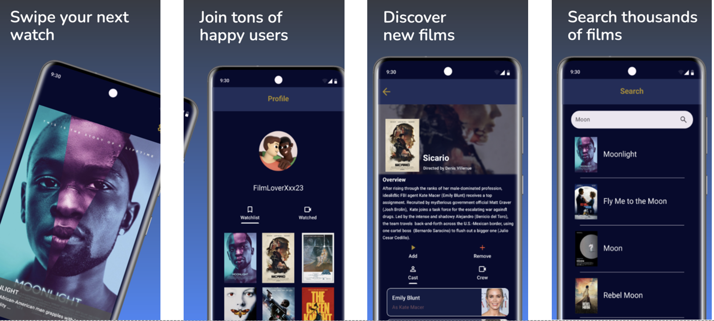

# Mobile Applications

## Project Description

Android mobile application group project during university named FilmSwipe. Developed using Android Studio, Kotlin, FireBase, and the TMDB Api. Users swipe on films retrieved from the API, with left discarding the film, right adding the film to the user's watchlist, and up marking the film as watched so it no longer appears. Users can visit other profiles and view their watched/watchlisted movies.
